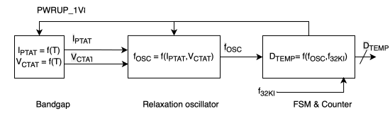
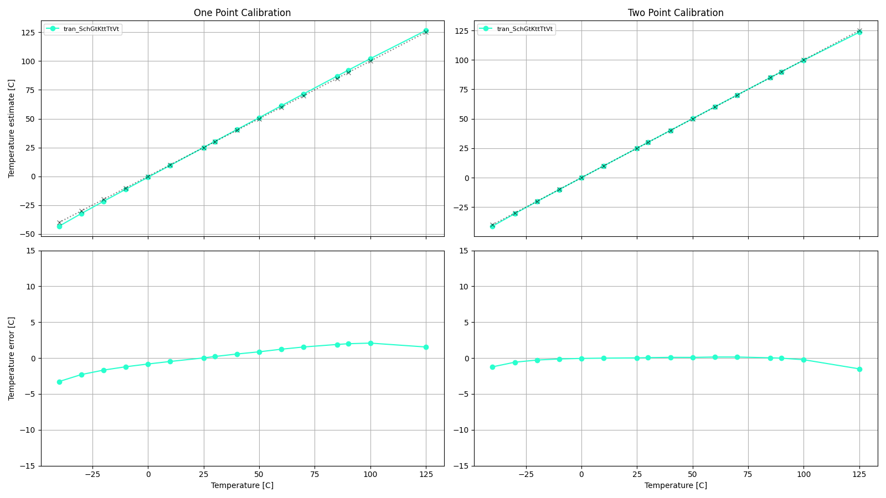
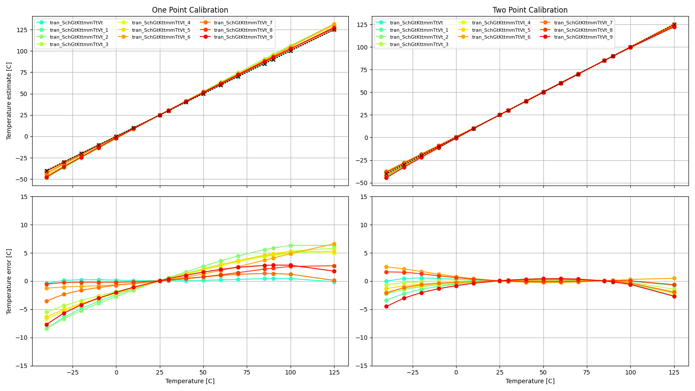
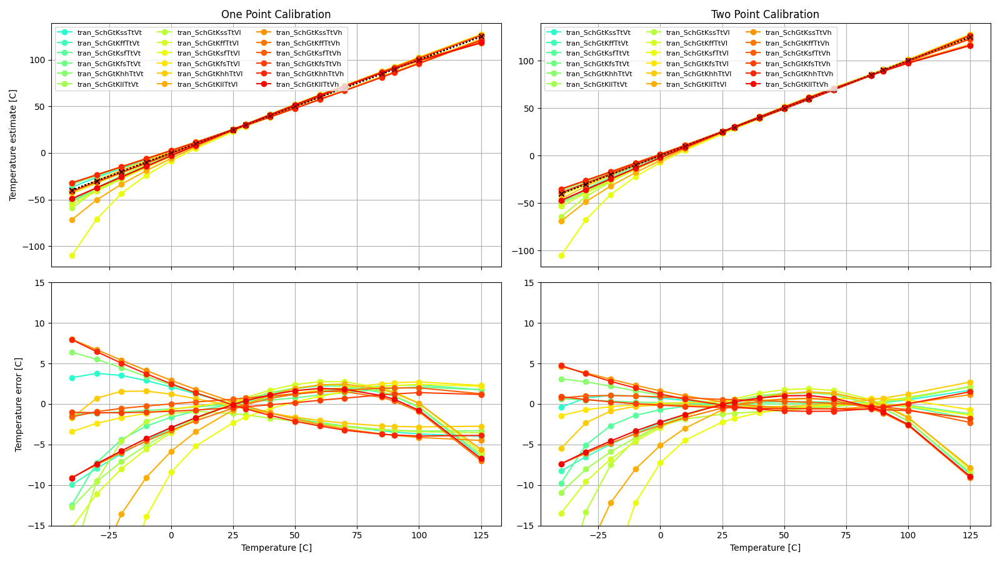

- **Repository:** [https://github.com/wulffern/lelo_temp_sky130a](https://github.com/wulffern/lelo_temp_sky130a)
- **Documentation:** [https://wulffern.github.io/lelo_temp_sky130a](https://wulffern.github.io/lelo_temp_sky130a)

# Who

Carsten Wulff

# Why

Example of a temperature sensor 

# How it works

One way to make a temperature sensor is to create a temperature dependent
oscillator, and then measure the frequency of the oscillator. In Figure 0 we can
see an overview. 

A bandgap circuit is used to make a current that is proportional to absolute
temperature ($I_{PTAT}$) and a voltage that is complementary to absolute
temperature ($V_{CTAT}$). A relaxation oscillator converts the current and
voltage into a frequency ($f_{OSC}$). A digital finite-state-machine and a
counter converts the frequency to a digital value that is proportional to
temperature. 

 Figure 0: System overview 

This temperature sensor was made to conform to the specification at [The
Project: Design a temperature sensor](https://analogicus.com/aic2026/2026/01/09/The-Project.html#the-project-design-a-temperature-sensor).

For more information on the oscillator, see [Schematics](http://analogicus.com/lelo_temp_sky130a/schematic.html).

To measure the frequency of the oscillator we need a frequency reference. One
reference that is usually available in a MCU system is a 32768 Hz oscillator
($f_{32KI}$ in Figure 0).
The reason for that specific frequency is to accurately be able to count to 1 second with
a binary counter, and apparently to have a frequency for the crystal that is
higher than 20 kHz, so we can't hear it (according to <https://youtu.be/_2By2ane2I4?si=8ltUNqAPL71zCQUW>).

The principle of operation of the FSM and counter can be seen in Figure 1. 

The FSM starts in a IDLE state where a counter is reset. Next the temperature dependent oscillator is
started, and a number of oscillator pulses are counted. The FSM runs on LF_CLK
and we use the count x LF_CLK to measure the oscillation frequency. 

After one clock period the FSM powers down the oscillator. In the CAPTURE state
the value of the counter is stored, and the FSM returns to idle.

Figure 1: Finite-State Machine to control temperature sensor 

A waveform of the sequence can be seen in Figure 2. When the signal start is
asserted the FSM transitions to power up
the oscillator (pwrupOsc=1), and we can notice the clkOsc counts the clock
pulses of the oscillator. On the next lfClk the oscillator is shut down and the
counter naturally stops. The value from the oscillator is stored in the cycles
register. 

Figure 2: Waves from simulation of the oscillator 

In the [testbench](sim/tb_lelo_temp/tb.v) I store the cycles, and the testbench
temperature to a file, and use [tb.py](sim/tb_lelo_temp/tb.py) to plot the
transfer function.

I use a physical model of the oscillator ([LELO_TEMP.py](py/LELO_TEMP.py)) to
create a function to turn the frequency back to a temperature. It can be seen
that the frequency has a non-zero second order derivative, and thus, the shape
of the curve needs to be compensated for. See the python model for details.

Figure 3: Simulation of the verilog model of the oscillator

| What            | Cell/Name                              |
|:----------------|:---------------------------------------|
| Schematic       | design/LELO_TEMP_SKY130A/LELO_TEMP.sch |
| Layout          | design/LELO_TEMP_SKY130A/LELO_TEMP.mag |
| Verilog Model   | design/LELO_TEMP_SKY130A/LELO_TEMP.v   |
| Verilog Counter | rtl/tempCounter.v                      |
| Verilog Fsm     | rtl/tempFsm.v                          |
| Verilog TB      | sim/tb_lelo_temp/tb.v                  |
| Analog top TB   | sim/LELO_TEMP/tran.spi                 |

# How to test

Power the tile (VDPWR = 1.8 V), then drive PWRUP_ANA (ui[0]) high to
power the analog core up. The temperature-dependent oscillator output
appears on OSC_TEMP (uo[0]); measure its frequency with a counter or a
logic analyzer. The frequency tracks temperature -- sweep the ambient
and record frequency versus temperature to calibrate. Drive PWRUP_ANA
low and the core powers down to leakage.

No external hardware is required beyond something that can measure a
digital frequency.

# Signal interface

| Signal       | Direction | Domain  | Description                                   |
|:-------------|:---------:|:-------:|:----------------------------------------------|
| VDD_1V8      | Input     | VDD_1V8 | Main supply                                   |
| PWRUP_1V8    | Input     | VDD_1V8 | Power up the temperature dependent oscillator |
| OSC_TEMP_1V8 | Output    | VDD_1V8 | Temperature dependent frequency               |
| VSS          | Input     | Ground  |                                               |

# Key parameters

| Parameter             | Min | Typ             | Max | Unit |
|:----------------------|:---:|:---------------:|:---:|:----:|
| Technology            |     | Skywater 130 nm |     |      |
| AVDD                  | 1.7 | 1.8             | 1.9 | V    |
| Oscillation frequency | 1.7 | 3.0             | 4.0 | MHz  |
| Temperature           | -40 | 27              | 125 | C    |

# Simulation graphs

Typical temperature error of the sensor is low, but I've calibrated the second
order correction for typical conditions.   

Over mismatch and extreme test condition (ETC) the temperature error increase. 

 Figure 4: Typical simulation results of the oscillator

 Figure 5: Mismatch simulation of the oscillator

 Figure 6: Extreme test conditions (PVT) simulation of oscillator 

# Block level simulations

The top level testbench measures the sensor as a whole, which makes it hard
to say *which* block moved when a number changes. Two blocks are therefore
also simulated on their own, with the bias block replaced by ideal 1 uA
sources, so their contribution can be attributed directly.

| Testbench | Block | Measures |
|:---|:---|:---|
| [sim/LELOTEMP_CMP](sim/LELOTEMP_CMP/README.md) | Comparator | Trip point, input referred offset, gain (`dc`); propagation delay at the real input slope (`tran`) |
| [sim/LELOTEMP_CCMP](sim/LELOTEMP_CCMP/README.md) | Comparator + integrating caps | Half period, effective capacitance, reset residue (`tran`) |

`LELOTEMP_CCMP` is the timing element of the relaxation oscillator: the 1 uA
bias charges five MIM caps, and the comparator trips when the ramp passes VC.
Its `t_half` is one half period of `OSC_TEMP_1V8`.

The comparator delay is worth watching because it adds to *every* half period,
so it is a direct period error rather than a second order effect. Both
testbenches measure it independently and agree.

Extraction costs roughly a factor two in that delay, and the effects compound:

| | Sch | Lay |
|:---|---:|---:|
| `LELOTEMP_CMP` propagation delay | 4.51 ns | 11.17 ns |
| `LELOTEMP_CCMP` effective capacitance | 285 fF | 316 fF |
| `LELOTEMP_CCMP` half period | 217.8 ns | 247.9 ns |

The parasitics add about 11% to the integrating capacitance and roughly double
the comparator delay, which together account for the 14% longer half period --
and for the extracted temperature error being about twice the schematic one.

Run them with `make report` in either directory; `VIEW=Lay` switches to the
extracted netlist.
